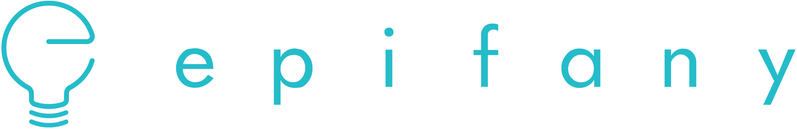
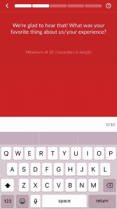
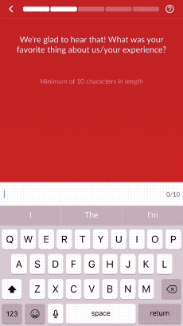

<p>
    
</p>

---

[](https://codeclimate.com/repos/5aec7a1f021c8602eb0001c5/maintainability)
[](https://circleci.com/gh/stealzinc/Epifany-iOS)
[](http://cocoapods.org/pods/Epifany)
[](http://cocoapods.org/pods/Epifany)
[](http://cocoapods.org/pods/Epifany)

## Example

To run the example project, clone the repo, and run `pod install` from the Example directory first.

# Table of Contents
1. [Requirements](#requirements)
2. [How it Works](#how-it-works)
3. [Installation](#installation)
3. [Usage](#usage)
    1. [Survey](#survey)
        1. [Check for Survey](#check-for-survey)
        2. [Start a Survey](#start-a-survey)
        3. [Finish a Question](#finish-a-question-or-survey)
        4. [Check Question Type](#check-question-type)
        5. [Product Question Tool](#product-question-tool)
        6. [Open Question Tool](#open-question-tool)
    2. [Beacons](#beacons)
        1. [Start Beacon Monitoring](#start-beacon-monitoring)
        2. [Beacon Options](#beacon-options)
        3. [Adding a Delegate for UI Updates](#adding-a-delegate-for-ui-updates)
        4. [Adding Background Delegate for Beacon Hits](#adding-background-delegate-for-beacon-hits)
        3. [Error Handling](#error-handling)
# Requirements

 - Location Permission is required to range beacons
 - Plist Permissions
    - Privacy - Bluetooth Peripheral Usage
    - Privacy - Location Always and When In Use Usage Description


# How it Works
Epifany listens for beacons (using bluetooth) in the background to verify the user is
at a venue. Once a beacon is seen, Epifany will notify your app through
a `EpifanyBackgroundDelegate` in order to produce a notification. This will allow
the user to take a survey. Once a survey is started you will use `EpifanySurvey`
to navigate through it.

**What if a user’s Bluetooth is turned off?** Don't Sweat it, you can use the user's current
location as a fall back.

# Installation

Epifany is available through [CocoaPods](http://cocoapods.org). To install
it, simply add the following line to your Podfile:

```ruby
pod 'Epifany'
```

# Usage

Initialize SDK from your AppDelegate.  We require an appToken and appId
that you can find on your dashboard or get from us.
```swift
EpifanyController.shared.setUp(token: "yourAppToken", id: yourAppId)
```
## Survey

### Check for Survey
This will be used to communicate with our server to see if there is a survey available.
The user's `email` is required to determine their survey status.
The user's `location` is used as a fallback if we have not seen a beacon.
The `mobileOrder` flag is used to let us know the user used mobile ordering.
The `completion` block allows you to update your UI when there is a survey.
```swift
EpifanyController.shared.checkForSurvey(email: "userEmail", 
location: CLLocation?, mobileOrder: Bool?, completion: { (available) in
    // Change start of start survey button
    }, failure: { (error) in
    // Handle error message
})
```
### Start a Survey
This is used to get a new survey from our server.
The user's `location` is used as a fallback if we have not seen a beacon.
The `mobileOrder` flag is used to let us know the user used mobile ordering.
The `completion` will return an EpifanySurvey object that helps you navigate
and interact with the survey.
```swift
EpifanyController.shared.newSurvey(email: "userEmail", 
location: CLLocation?, mobileOrder: Bool? completion: { (surveyController) in
    let viewController = ViewController()
    viewController.surveyController = surveyController
    self.present(viewController, animated: true, completion: nil)
    }, failure : { (error) in
    // Handle error message
})
```

Once you get a survey object you must first call `survey.getFirstQuestion()` to
get the first question.
 ```swift
 let question = survey.firstQuestion()
 ```
 ### Question Types and Flow
 
 When you get a question make sure you check the `question.type` to make sure you are present the right UI design. There are 3 `Question.Type` groups and a total of 7 `Question.Type\:
 1. Multiple Choice Questions
 1. `.multipleChoice` - A simple `UITableView` with single selection.
 2. `.mood` - A multiple choice question with some emojis or somethign with more character.
 3. `.slider` - A simple slider view where each value represents an answer.
 
 2. Open Answer Questions
 1. `.openAnswer` - A simple EditTextView that the user interacts.
 2. `.date` - Uses a date picker that submits the answer as a string in ISO8601 format.
 
 3. Multi-select Questions
 1. `.multiselect` - A simple `UITableView` with multi-selection
 2. `.product` - Preferably a Multi-select Dropdown menu
 
 The best way to check for this is use a switch statement like this: 

```swift
switch question.type! {
case .multipleChoice:
// Get Multiple Choice View Controller
case .openAnswer:
// Get Open Answer View Controller
case .mood:
// Get Mood View Controller
case .slider:
// Get Slider View Controller
case .date:
// Get Date View Controller
case .product:
// Get Product View Controller
case .multiselect:
// Get Multi-select View Controller
}

```
 
 Once the user selects/types and answer you must call `surveyController.nextQuestion()` to move to the next question. There are three different `surveyController.nextQuestion()` functions that each take
 a different parameter (String, Answer, \[Answer\]. The Question types are broken up that each group uses the same `surveyController.nextQuestion()` method:
 
 1. Multiple Choice Questions
 
 ```swift
// Example that grabs first answer from Answers list
let answer = questions.answers[0]
let nextQuestion = surveyController.nextQuestion(answer)
```

2. Open Answer Questions

```swift
// Example with some text
let answer = "Example Answer"
let nextQuestion = surveyController.nextQuestion(answer)
```

3. Multi-select Questions

```swift
// Example that grabs first two answers from Answers list
let answers = [Answer]()
answers.append(question.answers[0])
answers.append(question.answers[1])
let nextQuestion = surveyController.nextQuestion(answers)
```

When `surveyController.nextQuestion()` returns `nil` this means the user has reached the end of the survey. At this time you should call `surveyController.finishSurvey()`. The `SurveyFinishCallback` will let you know when we finished uploading the survey to our server.

```swift
    // answer is either a String, Answer, or [Answer]
    if let question = surveyContorller.nextQuestion(answer: answer) {
    // Start next question
    } else {
    // Finish survey flow
    surveyController?.finishSurvey() { (done) in
        print("FINISHED SURVEY")
        self.dismiss(animated: true, completion: nil)
    }
    }
```
### Product Question Tool
This tool is used to do three jobs:
1. Hints - Some `.openAnswer` questions will have hints that are fired based on a word or set of words a user types. This should be display in a way to prompt the user to keep typing. (See below)

     


2. Gibberish - When a user types a sentence that is considered not English this will be fired
This should be displayed in a way to let the user know they need to fix their answer. (See Below)

    


3. Character Limit - Every `.openAnswer` question requires a minimum amount of characters. This will fire when the user's answer passes the minimum threshold or goes below the threshold. You can also get the minimum character limit using `question.characterLimit` and may be a good idea to display this to the user.

The `EpifanyTextDelegate` is only fired when the state of gibberish, hints, or
character limit reached has changed.
```swift
// Whenever you select an answer pass it though our 
// check to make sure it is not a bundle/group of 
// answers
func tableView(_ tableView: UITableView, didSelectRowAt indexPath: IndexPath) {
    // Check answer may return an array of answers, this is for handling
    // value meals or other combo meals, or returns the current selection
    // if not a bundle.
    let answers = surveyController.checkAnswer(answer: answer)
    if answers.count > 1 {
        // Select the various answers
    } else {
        // Select the current answer
    }
}
```

### Open Question Tool
This tool is used to simplify updating gibberish, hints, & character limit reached.
The `listener` is only fired when the state of gibberish, hints, or
character limit reached has changed.
```swift
 
 class OpenViewController: UITextDelegate, EpifanyTextDelegate {
    //...
    func textViewDidChange(_ textView: UITextView) {
        // This will fire EpifanyTextDelegate if any
        // of the states change
        surveyController?.textUpdated(string: textView.text)
    }
    
    // ...
    func onGibberish(gibberish: Bool) {
        // Handle gibberish
    }
    
    func onHintChanged(hint: String) {
        // Handle hint
    }
    
    func onCharacterLimit(reached: Bool) {
        // Hanlde Character limit reached
    }
 }
```

You can choose to not use the `EpifanyTextDelegate` but you need to compare the length of the user's answer to  `question.characterLimit`. If the answer doesn't reach the minimum character limit it will cause an error when trying to post the survey.

## Beacons

### Start Beacon Monitoring
This will allow the user to range beacons. Call this after you gain location permissons.

### Beacon Options
You can also pass a `[BeaconOptions: Int]` to modify how beacon monitoring will work. Current there are only two usable `BeaconOptions`:
1. `.visits` - allows you to set the minimum number of visits before we notify the beacon delegates. Note: visits are based on days so when visits are set to 2 the delegates will be notified on the 2nd day they visit.
2. `.sinceVisit` - allows you to set a delay for when the delegates get fired until x seconds after the user leaves the range of the beacon. This is  useful if you would prefer the user to finish their meal or time at the venue before getting the survey.
These `BeaconOptions` can be used together as well.

```swift
    EpifanyController.shared.startMonitoringBeacons()
    // with options
    EpifanyController.shared.startMonitoringBeacons([.visits: 2, .sinceVisit: 60])
```

### Adding a Delegate for UI Updates
This `delegate` is used to udate the UI when the user see's a beacon.

```swift
class ViewContoller: EpifanyUiDelegate {
   // ...

    func didSeeBeacon(available: Bool) {
        // Update UI to reflect survey available
    }
    
    func beaconError(error: String) {
        // Handle beacon error
        if error == "No User Email" {
            EpifanyController.checkForSurvey(email: "userEmail", ...)
            ...
        }
    }
}

}
```

### Adding Background Delegate for Beacon Hits
This `delegate` is used in the background to allow you to send the user
a local notification when the user see's a beacon.
```swift
class AppDelegate: EpifanyBackgroundDelegate {
    // ...
    func didSeeBeacon(available: Bool) {
        // Send notification to user
    }
    
    func beaconError(error: String) {
        // Handle beacon error
        if error == "No User Email" {
            EpifanyController.checkForSurvey(email: "userEmail", ...)
    //        ...
        }
    }
}
```

## Error Handling
We provided a simple `EpifanyError` object that is returned whenever we receive an error from our servers. This object contains the `status code` and the `error message` for you to look at. Here are a few of the common errors that you may want to handle:

```swift
// ...
} failure: { (error) in
if error.message == EpifanyError.noUser {
// This mainly happens when we see a beacon before you provide us with the 
//user's email. The simplest solution here is to just hit the checkForSurvey
// with the user's email
EpifanyController.shared.checkForSurvey(email: "userEmail", location: nil, mobileOrder: false, completion: { (available) in
// Handle success
}, failure: { (error) in
//Handle error
})
}
// ...
if error.message == EpifanyError.noHost {
// This is usually caused by the user having wifi / mobile data off.
// Please prompt the user to turn on their wifi / mobile data.
}
// ...
if error.message == EpifanyError.invaildAppToken {
// This error only occurs if the app token you were provided is no longer
// working. Contact us immediately if this is happening in a production 
// build since the SDK will not work without a valid AppToken.
}

}
```
## Author

Shawn Murphy,  shawn.murphy@epifany.com

## License

Epifany is available under the MIT license. See the LICENSE file for more info.
